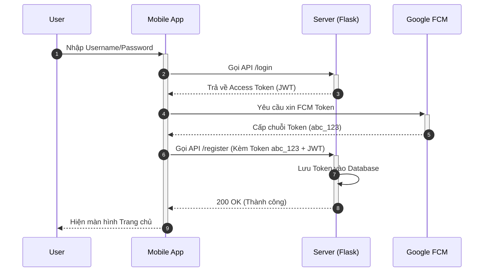
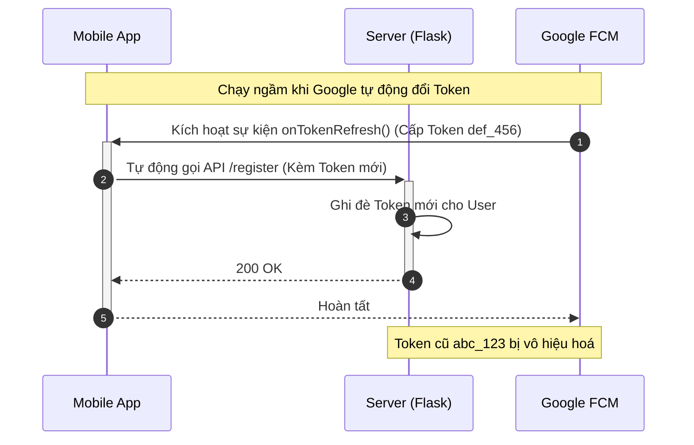
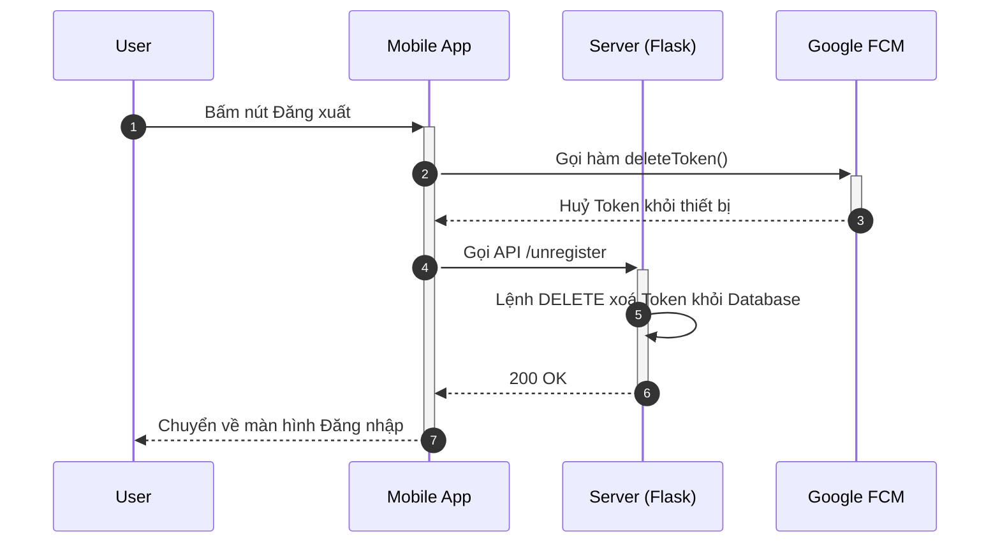
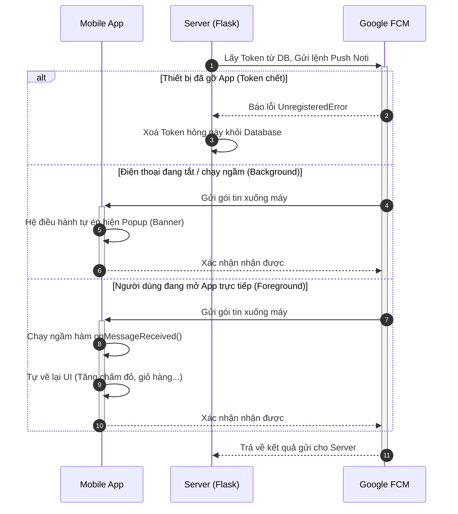

# Tài liệu Kiến trúc & Use Case: Hệ thống Push Notification (FCM)

Tài liệu này mô tả chi tiết toàn bộ các trường hợp sử dụng (Use Cases) và luồng hoạt động của hệ thống Push Notification từ phía Mobile App, Backend Server (Flask AppBuilder), cho đến máy chủ Google FCM.

## Các Thành phần Hệ thống

1. **Mobile App (Client)**: Ứng dụng điện thoại (iOS/Android/Flutter) đã cài đặt Firebase SDK. Nhiệm vụ: Sinh token, đăng ký token với Server, nhận và hiển thị thông báo.
2. **Backend Server (Flask)**: Lưu trữ và quản lý Token của người dùng. Ra lệnh gửi thông báo qua Firebase Admin SDK và dọn rác Database.
3. **Google Firebase (FCM)**: Máy chủ trung gian của Google, đóng vai trò định tuyến và phân phối hàng triệu thông báo tới các thiết bị dựa trên Token đích.

---

## Danh sách Use Cases (Trường hợp sử dụng)

### Use Case 1: Đăng ký FCM Token khi Đăng nhập
**Ngữ cảnh**: Người dùng mở app lần đầu và đăng nhập thành công.
* **Luồng hoạt động**:
  1. Mobile App gọi Firebase SDK xin cấp FCM Token.
  2. Mobile App lấy Token đó, gọi lên API `POST /api/v1/fcm/register` kèm theo `access_token` (JWT) của người dùng hiện tại để xác thực.
  3. Backend Server kiểm tra Database để lưu mới hoặc gán lại quyền sở hữu Token.

### Use Case 2: Bị làm mới Token (Refresh Token) trên App
**Ngữ cảnh**: Google Firebase định kỳ tự động làm mới Token (do bảo mật), hoặc người dùng xoá data ứng dụng/cài lại ứng dụng.
* **Luồng hoạt động**:
  1. Google FCM tự động phát sinh Token mới cho thiết bị.
  2. Firebase SDK trên điện thoại chạy ngầm hàm callback `onTokenRefresh` trả về Token mới.
  3. Mobile App tự động lấy Token mới này gọi API `POST /api/v1/fcm/register` lên Server.
  4. Server ghi đè (hoặc cập nhật) Token mới cho người dùng. Token cũ lúc này bị vô hiệu hoá.

### Use Case 3: Hủy Token khi Đăng Xuất (Logout)
**Ngữ cảnh**: Người dùng chủ động bấm Đăng xuất khỏi Mobile App.
* **Luồng hoạt động**:
  1. Người dùng bấm Đăng Xuất.
  2. Lập trình viên Mobile gọi hàm `deleteToken()` của Firebase SDK để vô hiệu hóa Token trực tiếp ở máy chủ Google.
  3. Mobile App gọi API `POST /api/v1/fcm/unregister` để chủ động báo Server Flask xoá Token khỏi Database.

### Use Case 4: Server Gửi Thông báo & Xử lý Lỗi (Unregistered)
**Ngữ cảnh**: Admin gửi thông báo. Nếu thiết bị đã gỡ cài đặt app, FCM trả về lỗi và Server dọn rác.
* **Luồng hoạt động**:
  1. Admin gửi thông báo qua màn hình quản trị.
  2. Server lấy danh sách Token từ DB và gọi Firebase Admin SDK.
  3. Nếu FCM báo lỗi `UnregisteredError`, Server tự xoá Token đó khỏi Database.

### Use Case 5: Ứng dụng điện thoại nhận thông báo (App State Behavior)
**Ngữ cảnh**: Thiết bị nhận được Push Noti.
* **Trường hợp A: App đang chạy ngầm (Background / Terminated)**: Hiện Banner Popup. Bấm vào Popup mở App.
* **Trường hợp B: App đang mở trực tiếp (Foreground)**: Không hiện Banner. Dữ liệu đi thẳng vào code Mobile để lập trình viên tự cập nhật UI (chấm đỏ, v.v...).

---

## Sơ đồ Sequence Diagram (Luồng hoạt động chi tiết có Activation Box)

### 1. Luồng Đăng nhập & Đăng ký Token

### 2. Luồng Bị làm mới Token (Refresh Token) ngầm

### 3. Luồng Đăng xuất (Logout)

### 4. Luồng Gửi thông báo, Bắt lỗi & Nhận thông báo trên App

